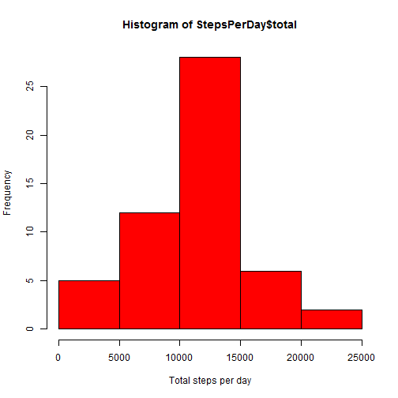
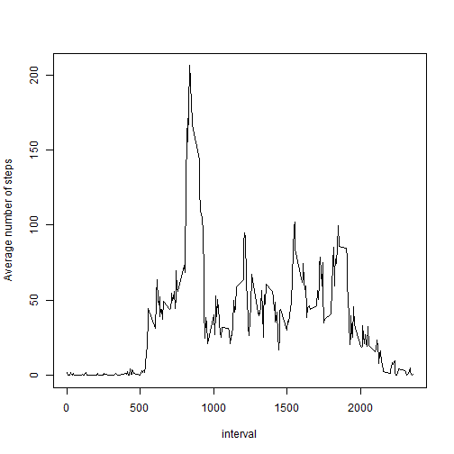
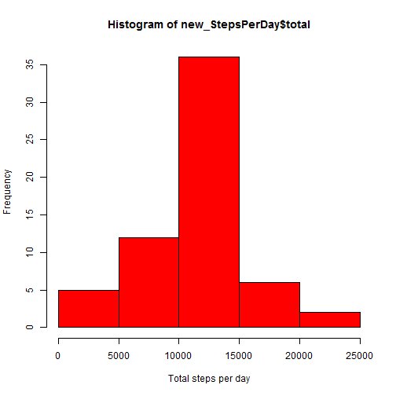

## Reproducible Research Peer Assessment 1
### Introduction

This assignment makes use of data from a personal activity monitoring
device. This device collects data at 5 minute intervals through out the
day. The data consists of two months of data from an anonymous
individual collected during the months of October and November, 2012
and include the number of steps taken in 5 minute intervals each day.  

The data for this assignment is downloaded from the course web
site:

* Dataset: [Activity monitoring data](https://d396qusza40orc.cloudfront.net/repdata%2Fdata%2Factivity.zip) [52K]

The variables included in this dataset are:

* **steps**: Number of steps taking in a 5-minute interval (missing
    values are coded as `NA`)

* **date**: The date on which the measurement was taken in YYYY-MM-DD
    format

* **interval**: Identifier for the 5-minute interval in which
    measurement was taken 
          
### Loading and preprocessing the data  


```r
  opts_chunk$set(echo=TRUE, results='hide')
```


```r
activity <- read.csv(unzip("RepData_PeerAssessment1/activity.zip", exdir="."))
```

```
## Warning in unzip("RepData_PeerAssessment1/activity.zip", exdir = "."):
## error 1 in extracting from zip file
```

```
## Error in file(file, "rt"): invalid 'description' argument
```

### What is mean total number of steps taken per day?

For this part of the assignment, the missing values are ignored from the dataset.  

```r
complete <- activity[complete.cases(activity$steps),]
library(plyr)
StepsPerDay <- ddply(complete, ~date, summarise, total=sum(steps), mean=mean(steps), sd=sd(steps))
```
The first few total, mean, and sd values are shown below    

```r
head(StepsPerDay)
```

        date total     mean         sd
1 2012-10-02   126  0.43750   6.912816
2 2012-10-03 11352 39.41667 111.897882
3 2012-10-04 12116 42.06944 108.601541
4 2012-10-05 13294 46.15972 120.916458
5 2012-10-06 15420 53.54167 121.204632
6 2012-10-07 11015 38.24653  88.333457
1. A histogram can be produced as follows  

```r
hist(StepsPerDay$total, col="red", xlab="Total steps per day")
```

 

2. Calculate and report the **mean** and **median** total number of steps taken per day

```r
MEAN <- mean(StepsPerDay$total)
MEDIAN <- median(StepsPerDay$total)  
```
The mean and median are `MEAN` and `MEDIAN`, respectively  

### What is the average daily activity pattern?

1. Time series plot (i.e. `type = "l"`) of the 5-minute interval (x-axis) and the average number of steps taken, averaged across all days (y-axis) is prepared as shown below  


```r
complete <- activity[complete.cases(activity$steps),]
StepsPerInterval <- ddply(complete, ~interval, summarise, mean=mean(steps), na.rm=TRUE)
with(StepsPerInterval, plot(interval, mean, type="l", ylab="Average number of steps"))
```

 

2. Which 5-minute interval, on average across all the days in the dataset, contains the maximum number of steps?  

```r
StepsPerInterval$interval[StepsPerInterval$mean==max(StepsPerInterval$mean)]
```

[1] 835

### Strategically replacing missing values

1. Calculate and report the total number of missing values in the dataset (i.e. the total number of rows with `NA`s)  

```r
Number_NA <- sum(is.na(activity))
```
The number of NA's is `Number_NA`  

2. Devise a strategy for filling in all of the missing values in the dataset.  
NA values in a given interval are replaced by the average number of steps in that interval  

```r
activity_noNA <- na.omit(activity)
avgSteps <- aggregate(activity_noNA$steps, by=list(activity_noNA$interval), data = activity_noNA, FUN = "mean")
names(avgSteps) <- c("interval", "meanSteps")
activity_new <- activity
for (i in 1:nrow(activity_new)) {
  if (is.na(activity_new$steps[i])) {
    activity_new$steps[i]<- avgSteps[which(activity_new$interval[i] == avgSteps$interval), ]$mean
  }
}
```

3. A new data set activity_new is created from the data set activity by replacing NA's as shown above.  
Shown below is the first few rows of the new data set

```r
head(activity_new)
```

      steps       date interval
1 1.7169811 2012-10-01        0
2 0.3396226 2012-10-01        5
3 0.1320755 2012-10-01       10
4 0.1509434 2012-10-01       15
5 0.0754717 2012-10-01       20
6 2.0943396 2012-10-01       25

4. Make a histogram of the total number of steps taken each day and Calculate and report the **mean** and **median** total number of steps taken per day. Do these values differ from the estimates from the first part of the assignment? What is the impact of imputing missing data on the estimates of the total daily number of steps?  

The following code chunk is used to produce the histogram

```r
new_StepsPerDay <- ddply(activity_new, ~date, summarise, total=sum(steps), mean=mean(steps), sd=sd(steps))
hist(new_StepsPerDay$total, col="red", xlab="Total steps per day")
```

 


```r
MEAN1 <- mean(new_StepsPerDay$total)
MEDIAN1 <- median(new_StepsPerDay$total)
```
The new mean and meadian are `MEAN1` and 'MEDIAN1`, respectively  
The global mean and median are relatively the same between the two datasets. But it can be seen from the two  
histograms that the mean and median for each day vary depending on the presence or absence of NA values


### Are there differences in activity patterns between weekdays and weekends?

1. Create a new factor variable in the dataset with two levels -- "weekday" and "weekend" indicating whether a given date is a weekday or weekend day.

```r
day <- weekdays(as.Date(activity_new$date))
dayType <- vector()
for (i in 1:nrow(activity_new)) {
  if (day[i] == "Saturday"|day[i] == "Sunday") {
    dayType[i] <- "Weekend"
  } else {
    dayType[i] <- "Weekday"
  }
}
```

2. Make a panel plot containing a time series plot (i.e. `type = "l"`) of the 5-minute interval (x-axis) and the average number of steps taken, averaged across all weekday days or weekend days (y-axis). 


```r
activity_new$dayType <- factor(dayType)
new_StepsPerInterval<- aggregate(steps ~ interval + dayType, data = activity_new, mean)
names(new_StepsPerInterval) <- c("interval", "dayType", "steps")
library(lattice)
xyplot(steps ~ interval | dayType, new_StepsPerInterval, type = "l", layout = c(1, 2), 
       xlab = "Interval", ylab = "Number of steps")
```

 

